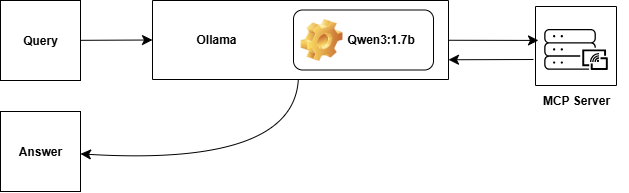

# Stock Agent - AI-Powered Stock Price Chat Application

A modern web application that combines Flask, PraisonAI Agents, and MCP (Model Context Protocol) to create an intelligent chat interface for querying stock prices. The application uses Ollama's Qwen3:1.7b model to provide natural language responses about stock market data.

## Architecture Overview



The application follows a modular architecture:

1. **Query** → User submits a stock-related question through the web interface
2. **Ollama (Qwen3:1.7b)** → Local LLM processes the query and determines if stock data is needed
3. **MCP Server** → Provides stock price data through a standardized protocol
4. **Answer** → AI agent returns a natural language response with stock information

## Features

- 🤖 **AI-Powered Conversations**: Natural language interface for stock queries
- 📈 **Real-time Stock Data**: Live stock price information via Yahoo Finance
- 🎨 **Modern UI**: Clean, responsive web interface with Bootstrap
- 📝 **Markdown Support**: Rich formatting for bot responses including code highlighting
- 🔄 **MCP Integration**: Modular tool system for extensible functionality
- 🚀 **Local Processing**: Runs entirely on your machine using Ollama

## Technology Stack

- **Backend**: Flask (Python web framework)
- **AI Agent**: PraisonAI Agents with Ollama integration
- **LLM**: Qwen3:1.7b (via Ollama)
- **Stock Data**: Yahoo Finance (yfinance)
- **Protocol**: MCP (Model Context Protocol)
- **Frontend**: HTML5, Bootstrap 5, JavaScript
- **Markdown**: Marked.js with Prism.js for syntax highlighting

## Prerequisites

Before running the application, ensure you have:

1. **Python 3.8+** installed
2. **Ollama** installed and running
3. **Qwen3:1.7b model** pulled in Ollama:
   ```bash
   ollama pull qwen3:1.7b
   ```

## Installation

1. **Clone the repository**:
   ```bash
   git clone <repository-url>
   cd "Stock Agent"
   ```

2. **Install Python dependencies**:
   ```bash
   pip install flask praisonaiagents yfinance mcp
   ```

3. **Set environment variables**:
   ```bash
   # Windows (PowerShell)
   $env:PYTHON_PATH = "python"
   $env:SERVER_PATH = "stock_price_server.py"
   
   # Linux/Mac
   export PYTHON_PATH="python"
   export SERVER_PATH="stock_price_server.py"
   ```

## Usage

1. **Start the application**:
   ```bash
   python app.py
   ```

2. **Open your browser** and navigate to:
   ```
   http://localhost:5000
   ```

3. **Start chatting!** Ask questions like:
   - "What's the current price of TSLA?"
   - "How is Apple stock doing today?"
   - "Give me the price for Microsoft"
   - "What's the latest price for Bitcoin (BTC-USD)?"

## Project Structure

```
Stock Agent/
├── app.py                 # Main Flask application
├── stock_price_server.py  # MCP server for stock data
├── templates/
│   └── index.html        # Web interface
├── stock_price.png       # Architecture diagram
└── README.md            # This file
```

## File Descriptions

### `app.py`
The main Flask application that:
- Sets up the web server and routes
- Initializes the PraisonAI agent with MCP tools
- Handles chat requests and responses
- Integrates with the Ollama LLM

### `stock_price_server.py`
An MCP server that:
- Provides the `get_stock_price` tool function
- Uses Yahoo Finance to fetch real-time stock data
- Handles errors and edge cases gracefully
- Communicates via standard I/O with the main application

### `templates/index.html`
A modern web interface featuring:
- Clean, responsive design with Bootstrap
- Real-time chat functionality
- Markdown rendering for rich bot responses
- Syntax highlighting for code blocks
- Smooth scrolling and user experience enhancements

## API Endpoints

### `GET /`
Serves the main chat interface.

### `POST /chat`
Processes chat messages and returns AI responses.

**Request Body**:
```json
{
  "message": "What's the price of AAPL?"
}
```

**Response**:
```json
{
  "reply": "AAPL current price: $175.84"
}
```

## MCP Tools

### `get_stock_price(ticker: str)`
Fetches the current stock price for a given ticker symbol.

**Parameters**:
- `ticker`: Stock symbol (e.g., "AAPL", "TSLA", "MSFT")

**Returns**:
- Formatted string with current price information
- Error message if ticker is invalid or data unavailable

## Customization

### Adding New Stock Data Features
To extend the stock functionality, modify `stock_price_server.py`:

```python
@mcp.tool()
async def get_stock_history(ticker: str, period: str = "1mo") -> str:
    """Get historical stock data"""
    # Implementation here
```

### Changing the AI Model
Update the model in `app.py`:

```python
agent = Agent(
    instructions=f"Your instructions here...",
    llm="ollama/your-preferred-model",  # Change this
    tools=MCP(f"{python_path} {server_path}")
)
```

### Styling the Interface
Modify the CSS in `templates/index.html` to customize the appearance.

## Troubleshooting

### Common Issues

1. **Ollama not running**: Ensure Ollama service is started
2. **Model not found**: Pull the required model with `ollama pull qwen3:1.7b`
3. **Environment variables**: Verify PYTHON_PATH and SERVER_PATH are set correctly
4. **Port conflicts**: Change the port in `app.py` if 5000 is occupied

### Error Messages

- **"No data found for [ticker]"**: Invalid ticker symbol or market closed
- **"Error: [details]"**: Network issues or Yahoo Finance API problems
- **Connection errors**: Check Ollama service and model availability

## Contributing

1. Fork the repository
2. Create a feature branch: `git checkout -b feature-name`
3. Make your changes and test thoroughly
4. Commit your changes: `git commit -am 'Add feature'`
5. Push to the branch: `git push origin feature-name`
6. Submit a pull request

## License

This project is open source and available under the [MIT License](LICENSE).


---


